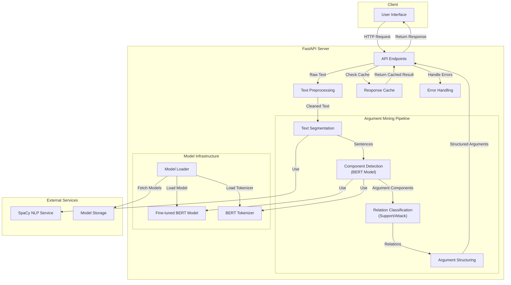

# Component Diagram

## Client Layer

User Interface: The frontend where users input text and receive analyzed argument structures.

## FastAPI Server Layer

API Endpoints: Contains endpoints like /analyze, /health, and /validate to handle requests.
Text Preprocessing: Cleans input text (removing excess whitespace, handling special characters).
Response Cache: Stores previous analysis results to improve performance for repeated queries.
Error Handling: Manages exceptions and provides meaningful error responses.

## Argument Mining Pipeline

Text Segmentation: Uses SpaCy to split text into sentences for individual analysis.
Component Detection: The BERT model identifies argument components (claims, premises, non-arguments).
Relation Classification: Determines relationships between components (support, attack).
Argument Structuring: Organizes components and relations into cohesive argument structures.

## Model Infrastructure

Model Loader: Responsible for loading the fine-tuned models efficiently.
Fine-tuned BERT Model: The core trained model for argument component classification.
BERT Tokenizer: Processes text into tokens that the BERT model can understand.

## External Services

SpaCy NLP Service: Provides text processing capabilities (sentence splitting, dependency parsing).
Model Storage: Where trained models are stored (could be local storage or cloud service).

## Data Flow

User submits text through the UI
FastAPI receives the request, checks cache, and preprocesses text
The argument mining pipeline processes the text sequentially:

Segmenting into units
Detecting components with BERT
Classifying relations
Structuring the full argument

Results are returned to the user interface

This architecture separates concerns while maintaining a clear data flow through the system, making it both scalable and maintainable.